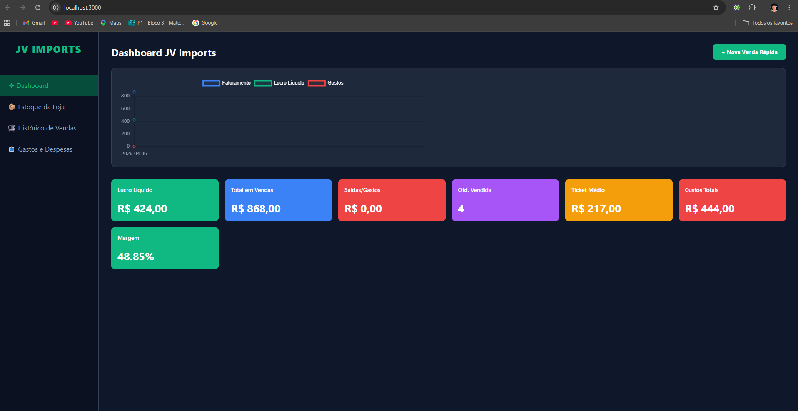

# JV Imports - Gestão Inteligente


## 📌 Nome do Projeto
JV Imports - Sistema de Gestão Financeira e Estoque

## 🎯 Descrição do Problema Real
Milhares de microempreendedores e pequenos lojistas sofrem diariamente com a desorganização financeira e a perda de controle do estoque. O uso de métodos manuais (cadernos ou planilhas difíceis) gera erros de cálculo, furos no inventário e falta de clareza sobre o Lucro Líquido real do negócio, o que frequentemente leva pequenas empresas à falência por falta de dados precisos.

## 💡 Proposta da Solução
A aplicação web (GUI) "JV Imports" unifica o controle de estoque, o histórico de vendas e o registro de despesas em um Dashboard centralizado e de fácil uso. O sistema calcula automaticamente o lucro líquido, o ticket médio e atualiza a quantidade de produtos no estoque em tempo real a cada nova venda registrada.

## 👥 Público-Alvo
Microempreendedores, revendedores autônomos e pequenos lojistas que necessitam de uma ferramenta intuitiva para gerir suas vendas e gastos sem curvas de aprendizado complexas.

## ✨ Funcionalidades Principais
- **Dashboard Financeiro:** Visualização de Lucro Líquido, Vendas, Saídas e Margem.
- **Controle de Estoque:** Cadastro, listagem e exclusão de produtos com cálculo de custo.
- **Histórico de Vendas:** Registro de vendas com baixa automática no estoque do produto selecionado.
- **Controle de Gastos:** Registro de despesas operacionais que impactam o lucro líquido.
- **Gráfico de Evolução:** Acompanhamento visual de Faturamento vs Lucro vs Gastos.

## 🛠️ Tecnologias Utilizadas
- **Linguagem Principal:** JavaScript (Node.js)
- **Backend:** Express.js
- **Frontend:** HTML5, CSS3, JS Vanilla, Chart.js
- **Banco de Dados:** SQLite (Armazenamento local/em arquivo) e PostgreSQL (Pronto para Nuvem)
- **Qualidade e Automação:** Jest (Testes), ESLint (Linting), GitHub Actions (CI/CD)

## 📸 Evidência de Funcionamento (Telas da Aplicação)



## ⚙️ Instruções de Instalação

1. Clone este repositório no seu ambiente local:
   ```bash
   git clone [https://github.com/joaoguimaraesalves/jv-imports.git](https://github.com/joaoguimaraesalves/jv-imports.git)
